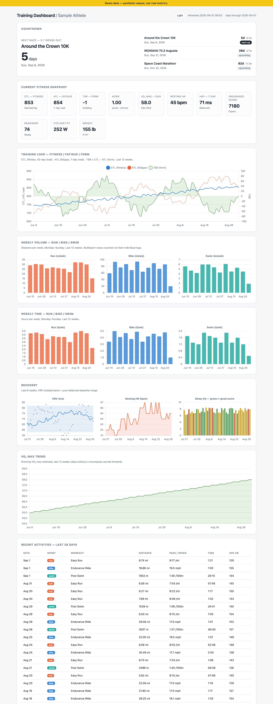
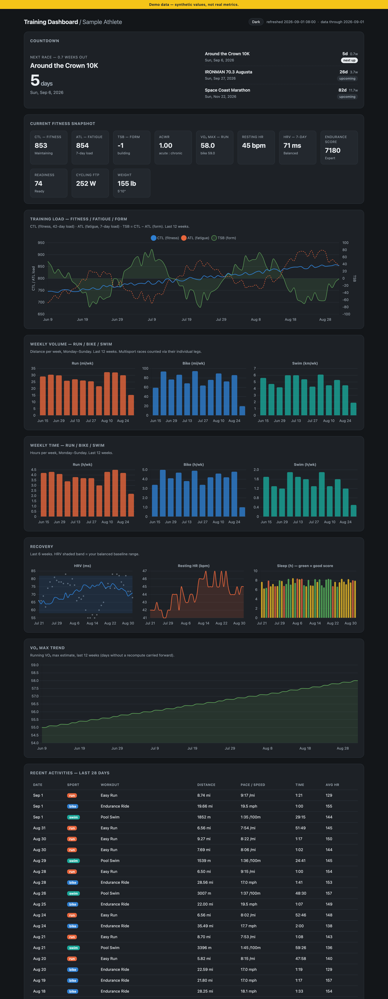

# Garmin Training Dashboard

A self-contained running / triathlon training dashboard built from
[Garmin Connect](https://connect.garmin.com) data. It pulls your training load,
weekly volume, recovery and race predictions and writes a single `index.html`
you open in a browser — no server, no build step, re-run any time to refresh.

<!-- After you push, replace OWNER/REPO below with your GitHub path. -->


> **Not affiliated with Garmin.** Built on the community
> [`python-garminconnect`](https://github.com/cyberjunky/python-garminconnect)
> library and the [`garmin_mcp`](https://github.com/Taxuspt/garmin_mcp) MCP server
> by **Taxuspt** — see [Credits](#credits).

<p align="center">
  
  
</p>

---

## Two ways to run it

| | Where | Use it when |
| --- | --- | --- |
| **`garmin_dashboard` package** | [`garmin_dashboard/`](garmin_dashboard/), run via [`dashboard.py`](dashboard.py) | The maintained version — config file, templating, tests, CI. Start here. |
| **Single-file script** | [`simple-garmin-dashboard/`](simple-garmin-dashboard/) | You want one file with nothing around it. Frozen; kept as the original prototype. |

Both authenticate the same way (cached OAuth tokens, no password prompt) and
produce the same dashboard.

---

## Quick start

### 1. Get Garmin tokens (via the MCP's auth CLI)

The [`garmin_mcp`](https://github.com/Taxuspt/garmin_mcp) project ships the auth
helper this dashboard relies on. It writes ~6-month OAuth tokens to
`~/.garminconnect`; after that nothing ever asks for your password again.

```bash
uvx --python 3.12 --from git+https://github.com/Taxuspt/garmin_mcp garmin-mcp-auth
```

It prompts for your Garmin email, password, and an MFA code if you have one
enabled. The same tokens are shared with the MCP server (below).

### 2. Build the dashboard

```bash
uv run dashboard.py             # fetch + render ./index.html
open index.html                 # macOS ("xdg-open" on Linux)
```

`uv` installs the dependencies into an isolated environment automatically. First
run takes ~1 minute (it fetches ~12 weeks of daily data); later runs are a few
seconds thanks to `./.dashboard_cache.json`. (`uv run python -m garmin_dashboard`
is equivalent; `pip install .` also gives you a `garmin-dashboard` command.)

No Garmin account handy? See the design and charts with synthetic data:

```bash
uv run dashboard.py --demo
```

### Useful flags

| Flag | Effect |
| --- | --- |
| `--demo` | Render from bundled synthetic data; no login. |
| `--no-fetch` | Re-render load/recovery from the cache without calling Garmin. |
| `--out PATH` | Write somewhere other than `./index.html`. |
| `--config PATH` | Use a different config file. |
| `--open` | Open the result in a browser when done. |
| `-v` / `-q` | More / less logging. |

---

## Configuration

Everything tunable lives in [`config.toml`](config.toml) — no code edits. Race
names and dates aren't sensitive, so the file is committed; drop a
`config.local.toml` next to it (gitignored) to override locally.

```toml
[windows]
load_weeks = 12          # CTL / ATL / TSB + VO2 max trend
recovery_weeks = 6       # HRV / resting HR / sleep
mileage_weeks = 12       # weekly volume + time
table_days = 28          # recent-activities table
refetch_recent_days = 3  # always re-pull the last N days

[[races]]
name = "Space Coast Marathon"
date = 2026-11-22
```

`GARMINTOKENS` overrides the token directory (default `~/.garminconnect`).

---

## What's on the dashboard

| Section | Shows |
| --- | --- |
| **Countdown** | Days / weeks to your next race, plus every configured race. |
| **Fitness snapshot** | CTL / ATL / TSB, ACWR, VO₂ max, resting HR, HRV, endurance, readiness, FTP, weight. |
| **Training load** | CTL (fitness), ATL (fatigue), TSB (form) over ~12 weeks. |
| **Weekly volume** | Distance per week by sport — run/bike (mi), swim (km) — Monday–Sunday buckets. |
| **Weekly time** | Same, in hours per week per sport. |
| **Recovery** | HRV 7-day avg with balanced-baseline band, resting HR, nightly sleep (bars coloured by score). |
| **VO₂ max trend** | Running VO₂ max estimate over ~12 weeks. |
| **Recent activities** | Runs / bikes / swims from the last ~4 weeks — date, sport, distance, pace/speed, time, HR. |
| **Personal records & predictions** | Run and swim PRs plus Garmin's current-fitness race-time predictions. |

The page follows your OS light/dark setting; the top-right button cycles
**Auto → Light → Dark** and remembers the choice.

---

## Architecture

```
config.toml ─▶ config.load_settings ─┐
                                     ▼
        GarminClient ──▶ fetchers/{daily,activities,profile} ──▶ DayCache + models
                                     │
                                     ▼
                         build.build_dashboard  (pure)
                                     │
                                     ▼
                         render.render  (Jinja2 + inlined CSS/JS)
                                     │
                                     ▼
                                 index.html
```

| Module | Responsibility |
| --- | --- |
| `config.py` | Parse `config.toml` / `config.local.toml` / env into a frozen `Settings`. |
| `garmin_client.py` | The only importer of `garminconnect`; token login + retry; raw getters. |
| `cache.py` | `DayCache` — per-day JSON store with `_have` stream tracking. |
| `fetchers/daily.py` | Pure `parse_*` for training-status / HRV / RHR / sleep + fetch loop. |
| `fetchers/activities.py` | Fetch window, drop `multi_sport` parents, classify sport, normalise. |
| `fetchers/profile.py` | PRs, race predictions, endurance tier, FTP, readiness. |
| `transform.py` | Pure: week bucketing, unit formatting, cache-derived chart series. |
| `build.py` | Assemble `DashboardData` from cache + activities + profile (pure). |
| `render.py` | Jinja2 template + inlined `static/dashboard.{css,js}` → HTML string. |
| `demo/` | Seeded synthetic dataset for `--demo` and the test fixtures. |

### Layout

```
garmin_dashboard/      the package (config, fetchers, transform, build, render, demo)
  templates/           dashboard.html.j2
  static/              dashboard.css, dashboard.js  (inlined at render time)
dashboard.py           thin launcher  ->  uv run dashboard.py
config.toml            races + window sizes
tests/                 pytest suite (pure transforms + render, fake Garmin client)
scripts/               make_sample_data.py  (regenerates fixtures + demo html)
simple-garmin-dashboard/   the frozen single-file prototype
```

The package is deliberately **not** installed into the venv (`[tool.uv] package =
false`) — you run it in place. That sidesteps a uv+CPython issue on macOS where
the editable-install `.pth` (hidden inside `.venv`) is skipped by newer `site.py`.

### Development

```bash
uv sync --dev
uv run pytest
uv run ruff check . && uv run ruff format --check .
uv run mypy
pre-commit install        # optional: run the above on every commit
```

CI (`.github/workflows/ci.yml`) runs lint, format, mypy, pytest, a `--demo`
smoke build, and a compile check on the single-file prototype for every push
and PR.

**Regenerating the screenshots / fixtures:**

```bash
uv run python scripts/make_sample_data.py     # -> tests/fixtures/ + dist/demo.html
# then screenshot dist/demo.html in a browser (light + dark) into docs/screenshots/
```

---

## The Garmin MCP server

This repo also ships an [`.mcp.json`](.mcp.json) so Claude Code (or any MCP
client) can load the [`garmin_mcp`](https://github.com/Taxuspt/garmin_mcp) server
by **Taxuspt** for interactive exploration of your Garmin account (~110 tools:
activities, health metrics, workouts, training status, trends…):

```
uvx --python 3.12 --from git+https://github.com/Taxuspt/garmin_mcp garmin-mcp
```

**The dashboard does not require the MCP server at runtime.** Both sit on the
same `python-garminconnect` library and the same cached tokens — the MCP is how
you *bootstrap the tokens* (`garmin-mcp-auth`) and how you poke at the data by
hand; the dashboard then talks to Garmin directly. The MCP's "trend" tools are
per-day loops over stock `garminconnect` calls, which is exactly what
`garmin_dashboard/fetchers/daily.py` reimplements for CTL/ATL/TSB.

---

## Privacy

`index.html` and `.dashboard_cache.json` embed real health data (HRV, resting
HR, sleep, training load, VO₂ max) and are **gitignored** — this repo never
contains your metrics. The screenshots and any committed demo output come from
`--demo` synthetic data. Your Garmin tokens live at `~/.garminconnect`, outside
the repo; never commit them.

---

## Troubleshooting

| Symptom | Fix |
| --- | --- |
| `Garmin login ... failed` | Tokens expired — re-run `garmin-mcp-auth`. |
| Charts blank, page otherwise fine | No internet on first open — Chart.js loads from a CDN. Reconnect, reload. |
| Last day or two looks off | Normal — Garmin keeps revising recent load/HRV; it self-corrects next run. |
| Want a clean rebuild | Delete `.dashboard_cache.json`, then re-run. |
| `ModuleNotFoundError: garmin_dashboard` | Run it from the repo root (`uv run dashboard.py`), not from inside `garmin_dashboard/`. |
| `tomllib` import error | Needs Python ≥ 3.11 (`.python-version` pins 3.12 for `uv`). |

---

## Notes & caveats

- **CTL / ATL / TSB** are Garmin's Acute/Chronic training-*load* numbers
  (scale ~1000), not TrainingPeaks TSS-based CTL. The form/fatigue reading is the same.
- **Multisport races** are counted via their individual legs, not the parent activity.
- **Swim volume** is shown in km; run and bike in miles.
- Garmin's 40K/100K cycling PRs on some accounts store inconsistent units, so
  they're left out of the PR panel.
- Race-time predictions are Garmin's estimates from current VO₂ max and recent
  training — not your PRs.

---

## Credits

- **[garmin_mcp](https://github.com/Taxuspt/garmin_mcp)** — Taxuspt — MCP server;
  ships the `garmin-mcp-auth` token helper this project depends on. MIT.
- **[python-garminconnect](https://github.com/cyberjunky/python-garminconnect)** —
  cyberjunky — the Garmin Connect client library. MIT.
- **[Chart.js](https://www.chartjs.org)** — charts. MIT.

Not affiliated with or endorsed by Garmin. See [`LICENSE`](LICENSE).
